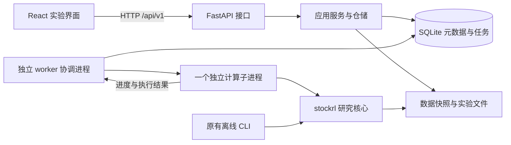

# StockRLTrader React + FastAPI 重构 Spec

- 状态：Draft，待用户审阅；不是实施授权。
- 日期：2026-09-08；基线：`a66ea1bc6f1cf7a8c5512dc0454634b33304a0ab`。
- 目标分支：本轮仅在 `docs/react-fastapi-refactor` 保存文档。
- 关联：[Review](../../reviews/2026-09-08-react-fastapi-review.md)、[ADR 索引](../../README.md)、[Plan](../plans/2026-09-08-react-fastapi.md)。

## 1. 目标与范围

把当前 Streamlit 实验工具迁移为 React + FastAPI 应用，使数据准备、实验提交、训练跟踪、结果分析和原样重放形成完整工作流。Web 和 CLI 复用同一个 RL 核心；浏览器关闭、换页和 API 重启不会自行取消已提交的训练。

“整个项目重构”覆盖界面、接口、应用编排、任务管理、存储契约、启动方式、依赖、测试和文档。对 `stockrl/` 只进行实现这些边界所需的适配，保留现有交易和研究语义。

首版定位为本地单用户研究工具，默认仅执行一个训练或重放任务；等待任务按队列排列。这是本提案的范围假设，尚未获得用户对具体设计的确认。

不在本次范围：多资产组合、盘中交易、实盘下单、券商连接、截面选股、监督学习预测、调整奖励或特征、算法调参平台、自动断点续训、分布式训练、账号与团队权限、公网部署、移动端独立产品。Yahoo 下载保留现有 CLI 能力，本轮不新增 Web 下载队列。

## 2. 全局约束

下列内容由实施计划逐字引用；任何变动需同步 Spec、ADR 和受影响验收。

- C-01：Python 3.12+；前端 Node.js 22.12+、npm、React、TypeScript、Vite；Windows 为首要验收平台，同时验证 Linux。
- C-02：日线、单资产、只做多、无融资无卖空；RL 直接决定目标仓位，不依赖 StockTrader 信号。
- C-03：观察 t 收盘、下一交易行开盘成交、同一行收盘估值；动作 [-1,1] 映射到目标仓位 [0,1]；费用只计入净值一次。
- C-04：训练、验证、测试的收益区间互不重叠；归一化只拟合训练段；验证选检查点；测试不参与选模或挑选 seed。
- C-05：训练、评估和基准共享 TradingEnv；数据末尾按市值截断；本次不改变算法超参数规则、观察特征、奖励和撮合语义。
- C-06：默认本机单用户、一个训练或重放任务执行；训练不运行在 HTTP 请求、API 进程或 FastAPI BackgroundTasks 中。
- C-07：保留用户行情、历史 CSV、旧 experiments.db 和既有实验；docs1/ 保持忽略；本轮只提交本地文档，不推送或编写项目代码。
- C-08：前端不接触服务器任意路径，不计算另一套绩效；API、CLI 和 worker 使用同一领域规则；合成演示和重放必须显式标注。

具体依赖版本在实施时通过兼容性检查锁定并提交锁文件；本文没有安装依赖。Node 下限是项目约束，不能替代对所选工具版本的实际检查。

本轮沿用现有 CPU 训练与线程配置，不增加 GPU 选择。配置上下限属于 Web 应用资源限制，不收紧原有 Python/CLI 接口可表达的研究参数。

## 3. 系统边界

| 模块 | 拟建位置 | 责任与依赖边界 |
|---|---|---|
| React SPA | `frontend-react/` | 页面、表单、路由、任务查询和图表；只经 API 访问业务数据 |
| HTTP 层 | `api/` | FastAPI 路由、输入输出模型绑定、错误与本地访问限制；不导入训练模块 |
| 应用层 | `stockrl_app/` | 数据集、实验请求、任务状态、产物查询、旧格式适配；不依赖 React、Streamlit 或 FastAPI |
| worker | `stockrl_app/jobs/` | 独立启动、排队执行、取消、心跳、进程回收和产物发布 |
| 研究核心 | `stockrl/` | 数据校验、特征、环境、训练和评估；不依赖 API、数据库或 UI |
| 存储 | `outputs/app/` 与 `outputs/experiments/` | 新应用状态和不可变实验文件；与根目录旧数据库分开 |

应用模型使用 Pydantic，领域层继续使用已有 Python 对象。进程间只传任务 ID、可序列化配置和受控路径，不传 DataFrame、训练模型或数据库连接。API 查询和启动不得因顶层导入 `stockrl.experiments` 间接加载 Torch/SB3；轻量切分规则可从该文件提取到 `stockrl/protocol.py`，保留原导出以兼容调用者。

前端使用 React Router 管理地址，TanStack Query 管理服务器数据，表单草稿用组件状态；不预先引入 Redux。拟用 Plotly.js 展示净值和仓位，指标由后端计算。UI 组件体系先用项目内组件与 CSS，不把某个大型组件库列为本轮必须条件。以上细分选型均属提案。

## 4. 用户工作流

### FR-01 数据准备

用户可生成合成行情、上传 CSV 或选择服务器列出的 `stock_data` 原始 CSV。已有 CLI 的 Yahoo 下载与本地 CSV 工作流继续可用。服务器对上传文件流设限，不按客户端文件名决定落盘路径。

每个数据集保存不可变的规范化 OHLCV 快照、原始来源说明、上传原文件指纹（适用时）、规范化快照指纹、行数、日期边界、演示标记和价格口径。价格口径允许 `unknown`，但界面明确显示“未声明”，不默认为前复权或后复权。原始 CSV 可保留供追溯；不得自动修正 OHLC、补价格、改复权或重采样。

三种登记入口均可填写 `adjustment`、`quote_unit` 与来源说明；前两者默认 unknown，演示数据的 quote_unit 固定为 synthetic_unit。source_kind 和 is_synthetic 由服务端确定，不能由客户端把演示重新标为真实行情。其他缺失元信息明确标为未知，不根据股票简称推断市场或币种。

支持沿用当前校验器可接受的日线日期表达，保持市场观察日语义；不把交易日期强制转换为 UTC 再切日。系统事件时间统一 UTC ISO 8601。

数据预览先校验，再返回最多 100 行样例和结构信息。无效/空 CSV、重复日、非法价格和不足切分的数据有可定位错误。数据集不足以训练时可以显示数据质量问题，但不能提交实验。

### FR-02 实验配置与预览

从数据集创建配置草稿。填写算法、步数、seed、回合长度、日期过滤、切分比例、资金与交易参数。提交前由服务端返回规范化配置、精确收益日期边界、数据指纹、预计执行的 seed 数和验证错误；用户界面显示这些事实，不自行计算切分。

记录 `purpose`（`technical_validation` 或 `research`）、研究问题文本、数据口径和比较说明。默认技术验证；研究实验必须有非空研究问题。该文本不自动生成盈利结论或统计检验，也不限制将来记录“RL 无优势”的结论。提交之后的配置和数据引用不可修改；再次实验产生新 ID。

| 配置 | 默认值或规则 |
|---|---|
| `algorithm` | `PPO`，可选 `SAC` |
| `timesteps` | 每个 seed 为 10000；API 整数范围 2～1000000 |
| `seeds` | `[42]`；1～10 个互异整数，每个为 0～4294967295；保持提交顺序 |
| `episode_length` | 126，正整数或 null；运行时继续沿用现有区间截断规则 |
| `train_ratio` / `val_ratio` | 0.6 / 0.2；均大于 0 且总和小于 1 |
| 收益区间最低长度 | 训练 20、验证 5、测试 5 个 transition，沿用现有规则 |
| `initial_cash` | 10000，有限且大于 0 |
| `commission` / `slippage` / `sell_tax` | 0.001 / 0.0005 / 0；有限、非负且小于 1 |
| `min_commission` / `lot_size` | 0 / 1；前者有限非负，后者正整数 |
| `max_participation` | 0.01；有限且在 [0,1] |
| `t_plus_one` | true；沿用当前日线语义，不宣称支持盘中 T+0/T+1 切换 |
| `drawdown_penalty` / `turnover_penalty` | 0 / 0；高级设置可显式提交有限非负值，沿用现有计算 |
| 可选日期过滤 | `start_date`、`end_date`；包含边界，作用于不可变数据快照；保存过滤后的实验 bars 和指纹 |

API 拒绝未知字段、非有限数字、用布尔值替代整数、重复 seed 或不合法比例。服务端默认值和限制由 capabilities 提供给前端；预览不是执行授权凭据，正式提交仍重复校验，不能信任浏览器返回的指纹或结果。

### FR-03 实验提交与幂等

提交在一个数据库事务内创建实验和 `queued` 任务，返回 HTTP 202、`experiment_id` 和 `job_id`。训练尚未开始时不得显示成功。`experiment_id` 为应用生成的 UUID；核心最终生成的 `run_id` 单独保存，不能把两者混用。

提交必须带 `Idempotency-Key`（UUID）。同一 key 和同一规范化请求返回原来的任务；相同 key、不同请求返回 409。首次确认提交之前，前端为该草稿持久保存 key，网络断线、重试和刷新后继续复用；只有用户明确创建新实验时才换 key。服务端保留幂等记录，不自动重试训练。

队列按 `created_at, job_id` 排序。默认最大 20 个未开始任务，达到限制返回 429；重复 key 的请求先返回原任务，不被容量检查误拒绝。worker 离线时允许入队，并明确提示等待 worker。

### FR-04 任务生命周期与取消

任务 `kind` 为 `train` 或 `replay`。实验产物完整性与任务状态分开记录。

| 当前状态 | 可到达状态 | 触发与语义 |
|---|---|---|
| `queued` | `running`、`cancelled` | worker 原子领取；或启动前取消 |
| `running` | `cancelling`、`succeeded`、`failed`、`interrupted` | 收到取消；完整发布；明确错误；已确认执行进程退出且没有可信终态 |
| `cancelling` | `cancelled`、`failed`、`interrupted` | 确认计算停止；取消清理出现明确错误；协调进程中断且无法确认正常取消 |
| `succeeded` / `failed` / `cancelled` / `interrupted` | 无 | 终态不可改回排队；再次运行创建新任务 |

运行中取消先返回 202，状态是 `cancelling`，不是立即 `cancelled`。重复取消是幂等的；已终止任务返回其现状，HTTP 200。完成与取消竞争由条件事务决定：成功事务先提交则取消无效；取消先提交则不能再发布为成功。

worker 协调进程独立于 API，只允许一个协调实例持有实例锁；计算子进程通过显式 `spawn` 启动。子进程持有独立全局执行锁，确保旧协调进程退出后仍存活的子进程不会与新任务重叠。锁要求同机本地文件系统，不以一个普通 PID 文件或过期时间冒充进程锁。

正常取消通过控制信号在训练步、seed 边界及评估循环检查；15 秒未退出时，协调进程终止其明确拥有的子进程，再等 5 秒确认退出。未确认退出则保持 `cancelling` 并报告错误，不谎报取消，也不释放并发名额。子进程不得自行创建额外训练进程。

API 重启只重新连接数据库，不重建执行队列或启动 worker。worker 每 5 秒持久化心跳；超过 30 秒未更新，接口标注 `worker_unavailable`，但不能只凭超时把活任务判为失败。

worker 重启先核对持久状态、执行锁和完成凭据。旧子进程仍占锁时进入恢复等待，不开始下一任务，也不根据可复用 PID 强杀其他进程。旧子进程通过父通信通道关闭感知协调进程丢失，在下一安全检查点退出；阻塞计算无法及时退出时，界面显示恢复等待，需用户停止该实例后再恢复。确认锁释放后：有可信成功凭据则完成发布核对；其余未完成任务标为 `interrupted`。不宣称支持断点续训。

进程所有者 token、任务 revision 和条件更新阻止过期执行结果修改新状态。失败、取消和中断保留已写诊断及部分 seed，但不计算“成功的多 seed 汇总”，也不纳入默认完整结果比较。

### FR-05 进度、事件和页面恢复

任务详情包含阶段 `preparing/training/validating/evaluating/publishing`、当前 seed、seed 顺序、计划和实际步数、已完成 seed 数、心跳、开始/结束时间及错误摘要。阶段表示正在执行的工作，不表示结果已经可信。

训练步进度为各 seed 的 `min(actual_steps, requested_steps)` 之和除以计划总步数，不因 seed 切换倒退；实际步数单独展示，以容纳 PPO rollout 超过请求步数的现有行为。训练达到 100% 后仍明确显示评估/保存阶段，只有任务成功才显示“实验完成”。重放只显示阶段和已完成 seed 数，不伪造训练百分比。进度更新不得改变原有验证检查点频率或选模规则。

每个任务事件有单调递增 `seq`，持久化状态变化、阶段、进度和错误。高频步数事件至多每秒一次，状态变化不丢弃。刷新或切页后按 ID 查询最新任务；事件按游标补取，重复事件按 seq 去重。

首版每 2 秒轮询任务详情，终态后停止；网络失败退避到最多 10 秒，并显示“连接中断，任务状态待确认”。浏览器断线不自动取消任务。页面恢复后重新请求服务端状态，不把浏览器缓存当作真相。

### FR-06 实验历史、详情与下载

实验列表可按算法、数据集、类型和执行状态筛选；有任务记录的显示真实状态，历史导入没有任务记录的显示“历史产物”，不能伪造一次成功执行。详情显示提交配置、数据与版本指纹、切分边界、各 seed、验证选择信息和产物完整性。

每个 seed 展示净值、实际仓位、目标仓位、交易记录、现金与费用；对比四个已有基准。所有指标来自保存的后端结果，含净收益、年化收益、波动、Sharpe、最大回撤、换手、费用、平均仓位和交易数。无定义指标保留 null，UI 显示“未定义”。明确 252 日年化、零无风险利率和总体标准差口径。

曲线字段沿用核心记录的 `date/nav/cash/shares/weight/requested_weight/executed_weight/turnover/cost`：weight 是收盘估值后的持仓比例，requested_weight 是该次决策请求比例，executed_weight 是开盘成交后的比例，三者不互相替代。回报、回撤、权重与费率以小数传输，例如 0.05 表示 5%；现金、净值和费用以数据集声明的计价单位显示。计价单位未知时显示“未声明计价单位”，不自动加美元或人民币符号。

历史与成交表采用分页，原始 CSV 可下载；图表最多返回 5000 个点，超过时按确定性抽样展示并标明抽样、原始行数和返回行数。抽样不能影响完整数据计算的指标；用户能下载原始全量序列。

浏览器通过产物 ID 下载白名单文件，不传输出目录或文件路径。文件不存在、指纹不符或格式无法读取时呈现独立的完整性错误，其他实验仍可浏览。

### FR-07 比较与研究解释

默认比较一个实验各 seed 的 RL 与基准，展示全部 seed 的均值、总体标准差和有效样本数，不按测试成绩挑选“最佳 seed”。`buy_hold` 仍指持续请求满仓、受约束时后续继续买入的现有基准，并写明这个名称的实际规则。

允许选择最多 4 个完整训练实验并排查看配置和指标。只有过滤后数据指纹、测试收益日期、交易配置、计价单位、核心语义版本和指标版本一致时，标为“同条件比较”；不满足时仍可查看，但列出差异且不生成合并排名。算法、训练步数和 seed 可以不同，必须展示。普通风险指标对比不标成“风险匹配验证”。

合成演示、技术验证和 replay 标记跟随列表、详情及导出说明。原样重放是可复现性检查，不是新增样本外证据。本轮不生成置信区间、显著性结论、买卖建议或盈利保证。

### FR-08 产物版本、历史导入与重放

新应用采用独立存储版本；新产物保留核心 `summary.json`、`bars.csv`、`seed_<seed>/` 的兼容布局，增加 `manifest.json` 和 `request.json`，版本为 1。manifest 保存产物相对路径、大小、SHA256、生成版本与来源关系；自身不列入自身的文件散列清单，其 hash 存在发布凭据中。另记 `core_semantics_version=1`、`metrics_version=1`、代码 commit/工作区是否有修改、依赖版本、Python 版本、CPU/线程配置和所有 seed。API 不直接把现有包含绝对路径的 summary 当成响应。

应用元数据存放于 `STOCKRL_APP_DIR`（默认 `outputs/app/`）下的新 `state.sqlite3`，数据快照在其 `datasets/`；完成产物使用已有 `STOCKRL_OUTPUT_DIR`（默认 `outputs/experiments/`）。数据库的 schema version 与产物 schema version 分开管理。配置根目录启动后固定并展示，不能经普通 HTTP 请求修改。

计算先写输出根目录内 `.staging/<job_id>/`，完成后由协调进程核对取消状态、文件、指纹和所有 seed，再在同一文件系统中移动至新目录并写成功状态。数据库和文件系统不是一个原子事务：必须保存发布凭据（job ID、owner token、目标目录、manifest hash），重启时核对“文件已发布、数据库未提交”的窗口。凭据与 manifest 匹配且没有已提交取消时才补记成功；其余保留为隔离产物并报告错误。禁止覆盖已有目录。

具体顺序为：事务外完成文件和 hash 校验；先持久化发布意图；最后一个短事务再次检查 owner/revision 和 running 状态，在事务内完成同盘目录移动、产物索引及 succeeded 更新后提交。取消若先提交，该最终事务必须拒绝发布；移动后崩溃导致数据库回滚时，先前的发布意图仍可用于核对。发布结束前不领取下一任务。

历史适配器将无 manifest 的现有 RL 目录识别为 `legacy-v0`。通过本地维护命令显式扫描配置的输出根目录，导入只读索引，不修改原文件；再次导入相同相对目录与指纹不重复登记。仅按旧协议固定布局解析路径，忽略 summary 中指向外部的绝对路径。

legacy-v0 只对本次基线已经验证的结构映射核心/指标版本；字段或生成来源不足以确认时把版本记为 unknown，不能加入“同条件比较”。不得仅因 JSON 能解析就认定兼容。

历史原始实验、旧 replay 和残缺目录分别识别；旧 replay 没有独立模型时必须解析并验证其原始来源，来源缺失则允许浏览完整报表但禁用重放。未知未来版本标为 unsupported；损坏文件标为 corrupt；二者都不触发训练。根目录旧 `experiments.db` 不自动读取、迁表或覆盖。

重放创建新 `experiment_id`、新 job 和新输出目录，记录 `kind=replay` 与 `source_experiment_id`；旧核心 replay 复用 run_id 的行为不能造成应用主键冲突。模型和归一化仅从已登记、可信的本地实验读取；Web 不接受上传模型包。显示结果不反序列化模型，执行重放时核对模型/数据指纹及依赖兼容；不兼容时返回可解释失败，不自动升级或重新训练。新 replay 产物应包含重放所需的源 bars.csv，以及各 seed 的 model.zip、normalizer.json、training.json 副本，并保留来源关系，保证目录可搬移。

### FR-09 本地启动与维护

开发时 Vite 独立运行并代理 `/api` 到 FastAPI；交付时 FastAPI 提供构建后的静态前端与 API，同源访问，独立 worker 继续作为单独进程。默认地址 `127.0.0.1:8000`，开发前端 `127.0.0.1:5173`；本轮不实际启动这些服务。

拟将 `run.py` 改为本地启动器：使用当前 Python 启动一个 API 和一个 worker，检查输出目录、数据库版本及前端构建是否存在；退出时停止接收新任务并进行受控取消。关闭浏览器不同于退出启动器。支持分别启动 API/worker 用于调试；进程导入不能自动启动服务，开发热重载不能产生第二个 worker。Windows 后台辅助进程不弹出额外终端窗口。

保留 `python -m stockrl demo/train/evaluate` 和 `run_pipeline.py` 的离线语义，不要求 API 或 worker 启动。CLI 输出不自动加入应用任务队列，可通过显式历史导入被索引。CLI 直接训练不受 Web 队列并发限制，文档提示用户在同机避免同时启动多个重任务。

健康接口分为进程存活和就绪：存活不加载模型；就绪返回数据库可访问、目录可写、前端构建、schema 兼容和 worker 心跳状态。worker 离线允许浏览与排队，响应标记 degraded；数据库不可用或 schema 不兼容时返回 503。

### FR-10 切换与清理

新旧 Web 在验证期间并存，目录使用 `frontend-react/` 和已有 `frontend/`，不提前覆盖。端到端、兼容和核心回归验收全部通过后，切换默认 `run.py`，移除活跃 Streamlit 页面、相关依赖、配置和专属测试；旧界面保存在 Git 历史中。

更新 README、安装说明、排错、数据备份、历史导入、任务中断及研究限制文档。最终干净安装不要求 Streamlit、Redis、Node 运行时服务或外部行情网络；构建 React 需要 Node，已构建前端运行只需 Python 服务。交付包需包含受验证的前端构建，源码安装需明确先构建。

回退仅改变应用代码与入口，不删除数据、不自动降级数据库。切换前保存已验证代码点、配置和 SQLite 一致性备份；旧版可继续读取既有核心格式的训练产物，新应用数据库由旧版忽略。依赖需要回到对应版本并重新验证。

## 5. HTTP 契约

统一前缀 `/api/v1`。Pydantic 模型生成 OpenAPI；前端提交生成的 TypeScript 类型与薄请求客户端，CI 检查生成差异。API、数据库和产物的版本号互不替代。

| 方法与路径 | 主要请求/响应 | 语义 |
|---|---|---|
| GET `/health/live`、`/health/ready` | 健康状态与组件状态 | 200；关键存储失败时 ready 为 503 |
| GET `/capabilities` | 默认值、参数范围、算法、基准、上传/队列限制与 schema version | 前端不重复维护默认值 |
| GET `/local-sources` | 允许选择的原始 CSV 的 source ID、显示名 | 不返回任意目录浏览能力 |
| GET `/datasets`、`/datasets/{id}` | 分页列表、Dataset 元数据 | 不存在为 404 |
| POST `/datasets/csv` | multipart 文件和来源说明 → Dataset | 201；超过 20 MiB 为 413 |
| POST `/datasets/demo` | rows、seed → Dataset | 201，强制合成标记；默认 756 行、seed 42 |
| POST `/datasets/local` | source ID、价格口径 → Dataset | 201，重新校验白名单文件 |
| GET `/datasets/{id}/preview` | 样例、总行数和质量信息 | 不超过 100 行 |
| POST `/experiment-previews` | ExperimentRequest → 规范化配置和切分 | 200；不写实验或任务 |
| POST `/experiments` | ExperimentRequest + Idempotency-Key → experiment_id、job_id | 202；原子入队 |
| GET `/experiments`、`/experiments/{id}` | 筛选分页、ExperimentDetail | 完整性与任务状态分开 |
| GET `/jobs`、`/jobs/{id}` | 筛选分页、JobDetail | 服务器持久状态 |
| POST `/jobs/{id}/cancel` | 无配置 → JobDetail | 202 等待停止；已终态为 200 |
| GET `/jobs/{id}/events?after_seq=...` | items、next_seq、has_more | seq 升序，补取不丢状态 |
| GET `/experiments/{id}/series` | seed、policy、max_points → 曲线及抽样说明 | policy 为 rl/cash/buy_hold/half/trend |
| GET `/experiments/{id}/trades` | seed、policy、cursor、limit → 成交分页 | 原始数值，不从图表反推 |
| GET `/experiments/{id}/artifacts` | 已登记产物 ID、类型、大小和指纹 | 只读白名单 |
| GET `/artifacts/{id}/download` | 原始文件 | 路径边界与完整性检查 |
| POST `/experiments/{id}/replays` | 空配置体 + Idempotency-Key → 新 experiment_id、job_id | 202；仅使用源实验配置 |

`ExperimentRequest` 含 dataset_id、purpose、research_question、start_date、end_date、algorithm、timesteps、seeds、episode_length、train_ratio、val_ratio、trading_config；服务端补齐默认值，保存 canonical request hash。客户端不能指定模型类名、可执行命令、Python 表达式、模块导入或输出目录。

核心响应对象的最小字段如下，实施时在 OpenAPI 中定义精确类型；不能靠直接透传内部 summary 代替这些对象。

| 对象 | 必需内容 |
|---|---|
| `Dataset` | dataset_id、source_kind、display_name、is_synthetic、adjustment、quote_unit、rows、first_date、last_date、snapshot_sha256、created_at；quote_unit 可为 unknown |
| `ExperimentPreview` | canonical_request、request_sha256、filtered_data_sha256、splits、seed_count、warnings；splits 包含观察起点、首个收益日、最后收益日和收益数 |
| `SubmissionResult` | experiment_id、job_id；幂等重试返回相同两个 ID |
| `JobDetail` | job_id、experiment_id、kind、status、revision、phase、seed、seed_index、seed_count、requested_steps_total、actual_steps_total、training_fraction、completed_seeds、created_at、started_at、finished_at、heartbeat_at、worker_available、recovery_waiting、error；未发生的时间/阶段字段及 replay 的训练比例可为 null |
| `JobEvent` | job_id、seq、occurred_at、event_type、payload；event_type 为 state/phase/progress/error，payload 使用相应类型，禁止随意写任意内部对象 |
| `ExperimentDetail` | experiment_id、kind、source_experiment_id、job_id、run_id、request、dataset 摘要、splits、versions、integrity、replayable、replay_block_reason、runs、aggregate、artifacts；尚未产出的结果为 null/空列表并说明状态 |
| `SeriesResponse` | seed、policy、points、original_count、returned_count、is_sampled；points 使用 FR-06 的核心曲线字段 |
| `ArtifactRecord`（对外） | artifact_id、experiment_id、kind、filename、size、sha256、download_url；不含根目录、owner token 或内部绝对路径 |

`integrity` 使用 pending/complete/partial/corrupt/unsupported；queued 对应 pending，已核验成功对应 complete，失败或取消保留文件对应 partial，损坏对应 corrupt，未知格式对应 unsupported。历史来源缺失由 replayable=false 与具体原因表达，可保留完整报表的 complete；没有任务记录时 job_id 为 null，不补造 JobDetail。用于比较的完整训练结果要求 integrity=complete 且有成功任务，或属于已核验的历史训练报告。

列表默认 limit=20，范围 1～100；按 created_at 降序、ID 作稳定次序，cursor 为不透明字符串。事件 limit 默认 100、最大 500，after_seq 默认 0。曲线 max_points 默认且最大 5000、最小 100，短曲线返回全量。CSV/演示数据均限制最多 100000 行；上传限制在流式接收阶段执行，不能先无界读入内存。

错误形状统一为 `error.code`、`error.message`、`error.details` 和 `request_id`。字段错误 details 含 field 与 reason；422 为无效请求，404 为资源不存在，409 为状态/幂等/版本/完整性冲突，413 为文件过大，429 为队列容量，503 为关键服务不可用，500 为未预期异常。重放能否进行在详情中通过 replayable 与原因显示。客户端显示可操作中文消息，服务端日志保留完整堆栈并关联 request_id/job_id。

## 6. 存储和运行边界

最小数据表：schema_migrations、datasets、experiments、jobs、job_events、artifacts、idempotency_keys、worker_instances。实验持有配置/请求哈希、dataset_id、kind、source_experiment_id、job_id（历史导入可为空）与产物版本；jobs 持有状态、revision、owner token、取消标记、进度、时间和错误；artifacts 持有受控根目录 ID、相对路径、hash 与类型。外键及唯一约束负责去重，不用 UI 按钮禁用代替一致性。

SQLite 使用 WAL、foreign_keys 和短写事务，busy_timeout 默认 5 秒；计算与文件散列在事务外完成，最后短事务验证状态并发布。数据库与锁仅支持本机磁盘；不放网络共享盘。schema 不兼容时拒绝写入，升级是显式本地维护操作并先备份，不能在 API 导入模块时悄悄改表。

默认 worker 心跳 5 秒、失联提示 30 秒、取消宽限 15 秒、终止确认 5 秒、单任务总时限 12 小时；总时限覆盖训练/重放各阶段，从实际开始计时，超限执行受控停止，确认退出后标记 failed 与 TIME_LIMIT_EXCEEDED。上述均为应用能力，不改变 CLI 核心默认语义。首版不自动清理用户数据或实验目录。

默认只绑定 loopback，校验 Host；写请求校验 Origin，并要求严格 Content-Type（CSV 入口使用 multipart）。开发来源仅允许明确配置的 127.0.0.1/localhost 前端地址；本地维护客户端无 Origin 时仍需合法 Host 和请求格式。CORS 不是身份认证，不把本地模式用于公网或多租户部署。所有文件访问先解析符号链接/Windows junction，再核对实际根目录范围，拒绝越界；错误响应不返回绝对路径、密钥或完整堆栈。

## 7. 前端信息架构与状态

| 路由 | 主要内容 | 必须处理的状态 |
|---|---|---|
| `/datasets` | 来源选择、上传、价格口径、质量和预览 | 空数据、载入中、无效 CSV、上传超限 |
| `/experiments/new` | 配置、研究说明、日期预览、确认提交 | 草稿、校验错误、提交中、结果未知后的幂等重试 |
| `/jobs`、`/jobs/:id` | 队列、进度、取消、事件、错误 | 排队、运行、取消中、终态、worker 失联与恢复等待 |
| `/experiments`、`/experiments/:id` | 历史、配置、曲线、基准、各 seed、下载、重放 | 无结果、历史来源缺失、损坏、不兼容、部分产物 |
| `/compare` | 最多 4 个训练实验的并排配置和指标 | 条件相同/不相同、不可用指标、无选择 |

保留清楚的中文研究界面；主要阅读对象是数据日期、配置、净值和仓位，不在产品流程显示 Python 模块名、进程 token 或内部绝对路径。任务 ID 可复制用于定位。控制项有可访问名称，键盘可操作；颜色不能是状态或涨跌的唯一表达。主要验收尺寸为 1440×900 和 1280×720，窄屏表格可横向滚动且主操作仍可用。

服务器数据刷新不覆盖用户未提交表单；只有用户明确选择复制某实验配置才替换草稿。请求失败保留输入，重试使用同一幂等 key；网络错误不能伪装成任务失败。详情页直接打开和刷新都必须有效。

## 8. 验收条件与追踪

所有 AC 均为未来实施验收，本轮没有声称通过。

| 编号 | 可检验的结果 | 覆盖需求 |
|---|---|---|
| AC-01 | 合成、上传、白名单本地 CSV 均可登记；非法 OHLC、同日重复、超限文件和路径越界被拒绝且不生成可训练快照 | FR-01，C-08 |
| AC-02 | API 与 CLI 对相同有效配置产生相同切分、核心参数和数据输入；无效参数在启动训练前报错 | FR-02，C-02～05 |
| AC-03 | 两个并发相同 key 请求只产生一任务；key 冲突 409；队列满 429；API 重启后任务和幂等记录仍可查询 | FR-03 |
| AC-04 | 真实 PPO 和 SAC 各至少一个短实验确有梯度更新；多个 seed 完整保存；训练期间健康/状态接口保持响应 | FR-03～05 |
| AC-05 | 排队取消不启动进程；运行取消先 cancelling 后确认终态；重复取消无副作用；取消/成功竞态只产生一个合法结果 | FR-04 |
| AC-06 | 关闭浏览器、刷新和 API 重启不重跑/丢失任务；worker 被终止后可识别孤儿执行，锁未释放不并发启动，确认退出后不完整任务为 interrupted | FR-04～05 |
| AC-07 | 进度跨 seed 不倒退，实际步数可超过请求预算；保存前不显示完成；断线恢复能补取事件 | FR-05 |
| AC-08 | UI 指标与保存报表一致，null 不显示为 0；基准规则可见；图表抽样不改变指标，下载仍是完整数据 | FR-06～07 |
| AC-09 | 比较条件不同会列出差异且不生成合并排名；演示、技术验证及 replay 标记不会丢失 | FR-07 |
| AC-10 | 旧完整训练目录可只读导入与搬移重放；重复导入不重复；旧 replay 来源缺失、损坏和未知版本被区别处理；旧数据库和用户文件字节不变 | FR-08 |
| AC-11 | 在相同环境中加载同一模型重放，逐日 NAV 与原记录绝对误差不超过 1e-8；新 replay ID 独立，源文件不被覆盖 | FR-08，C-04～05 |
| AC-12 | 在产物移动与数据库提交间注入崩溃，重启后按凭据恢复或隔离；不出现缺文件的成功任务或取消后发布成功 | FR-04、08 |
| AC-13 | 生成类型与 OpenAPI 一致；任意路径/非法来源请求被拒绝；多 worker 启动不重复领取；API 导入不加载 Torch/SB3 | FR-01～09 |
| AC-14 | Windows 和 Linux 干净安装、前端构建、静态深链接、启动/退出、只用 CLI 均通过；最终无 Streamlit 必需依赖；回退演练不删除数据 | FR-09～10 |
| AC-15 | 既有资金、时序、费用、因果特征、切分和选模回归通过；新增覆盖不以复制实现代替手算/外部行为断言 | C-02～05，FR-10 |

AC-04 的接口响应目标：在记录硬件/依赖版本的本机、一个短训练运行时，以 2 秒间隔请求状态与 live 各 20 次，全部在 2 秒内响应；这是验收目标，不是尚未测量的性能承诺。长训练收益和策略有效性不属于软件迁移验收。

## 9. 提案审阅点

需要用户审阅的主要取舍是：本地单用户与单执行任务；保留 RL 数学语义的分层迁移；SQLite 加本地文件；轮询进度；不自动续训；过渡验收后移除活跃 Streamlit。React + FastAPI 方向已明确，其余选择在 ADR 中保留了备选方案。

本 Spec 与 Plan 一并提供用于审查，不因计划已经写好而开始实现。用户后续要求推送文档时只推送已审查文档分支；是否启动开发按后续明确指令处理。
